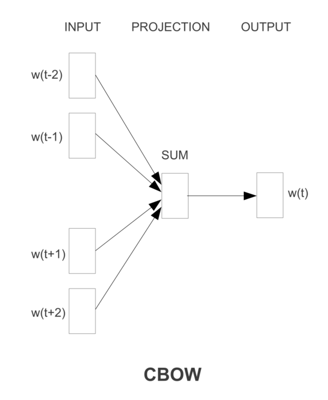

# Efficient Estimation of Word Representations in Vector Space

**发表刊物/会议：**

**发表年份：** 2013

**论文地址：** https://arxiv.org/abs/1301.3781

**代码地址：**

## 内容概要

我们提出了两种新颖的模型架构，用于从非常大的数据集中计算单词的连续向量表示。这些表示的质量是在**单词相似度任务**中测量的，并将结果与​​以前基于不同类型神经网络的最佳性能技术进行比较。我们观察到以更低的计算成本显着提高了准确性即从 16 亿个单词数据集中学习高质量的单词向量只需不到一天的时间。此外，我们表明这些向量在我们的测试集上提供了最先进的性能，用于测量句法和语义词的相似性。

## 主要解决问题/应用

- 我们尝试通过开发新的模型架构来最大限度地提高这些向量运算的准确性，以保持单词之间的线性规律。
- 设计了一个新的综合测试集来测量句法和语义规则，并表明可以以高精度学习许多这样的规则。
- 讨论了训练时间和准确性如何取决于词向量的维度和训练数据的数量。
  

## 主要使用方法/模型

**Feedforward Neural Net Language Model (NNLM)** 由输入层、投影层、隐藏层和输出层组成。
为克服NNLM的某些限制，例如需要制定上下文的长度， **Recurrent Neural Net Language Model (RNNLM)** 被提出。RNN模型没有投影层；只有输入层、隐藏层和输出层。这种模型的特别之处在于使用延时连接将隐藏层连接到自身的循环矩阵。这允许循环模型形成某种短期记忆，因为过去的信息可以由隐藏层状态表示，该隐藏层状态根据当前输入和前一个时间步的隐藏层状态进行更新。

大部分复杂性是由模型中的非线性隐藏层引起的。在本节中，我们提出了两种新的模型架构，用于学习单词的分布式表示，以尽量减少计算复杂度。

**CBOW:**
- 第一个提出的架构类似于前馈 NNLM，其中去除了非线性隐藏层，所有单词共享投影层（不仅仅是投影矩阵）；因此，所有单词都被投影到相同的位置（它们的向量被平均）。
- 历史中的单词顺序不会影响投影
- 此外，还使用未来的词语

与标准的词袋模型不同，它使用上下文的连续分布式表示。请注意，输入层和投影层之间的权重矩阵以与 NNLM 中相同的方式为所有单词位置共享。

**Skip-gram:**

第二种架构类似于 CBOW，但它不是根据上下文预测当前单词，而是尝试根据同一句子中的另一个单词最大化对单词的分类。

更准确地说，我们使用每个当前单词作为具有连续投影层的对数线性分类器的输入，并预测当前单词前后一定范围内的单词。我们发现增加范围可以提高结果词向量的质量，但也会增加计算复杂度。由于距离较远的词通常与当前词的相关性低于与当前词的相关性，因此我们通过在训练示例中从这些词中抽取较少的样本来给予较远的词更少的权重。

## 主要实验手段/数据集

## 创造性思考

在本文中，我们研究了由各种模型在一系列句法和语义语言任务上派生的词向量表示的质量。我们观察到，与流行的神经网络模型（前馈和递归）相比，可以使用非常简单的模型架构来训练高质量的词向量。由于计算复杂度低得多，因此可以从更大的数据集中计算非常准确的高维词向量。

## 批判式思考

## 讨论 

## Abastract

## Introduction

**本文的主要目标是介绍可用于从包含数十亿单词和词汇表中数百万单词的庞大数据集中学习高质量单词向量的技术。**

所做工作：

## Conclusion

